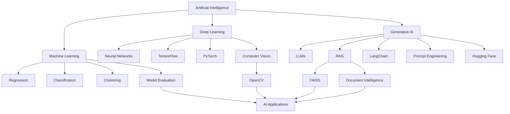
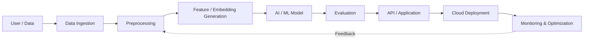
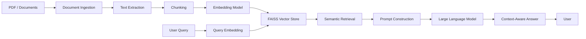
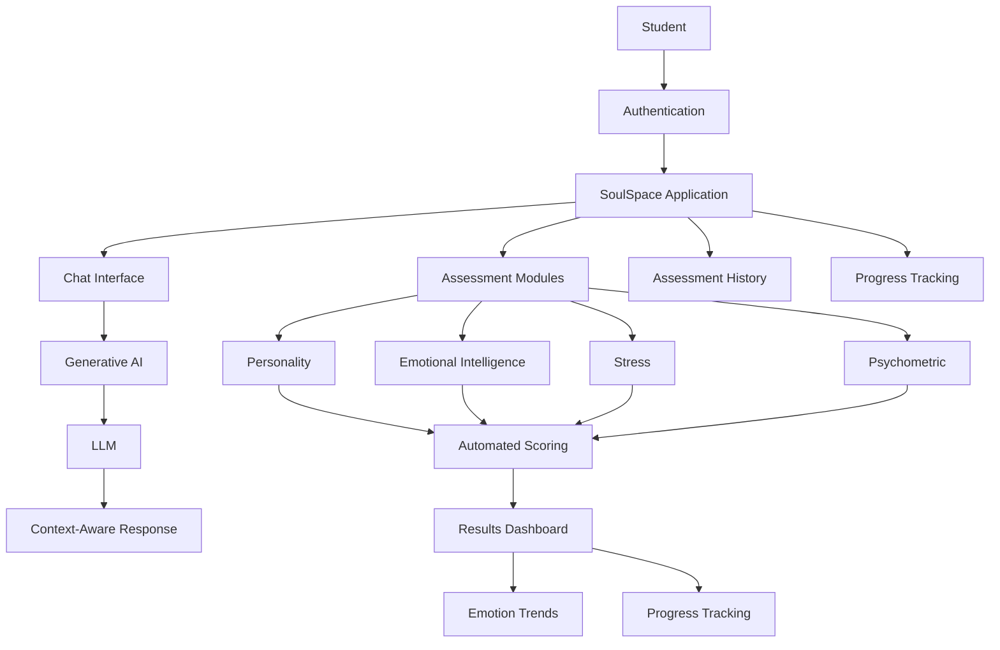
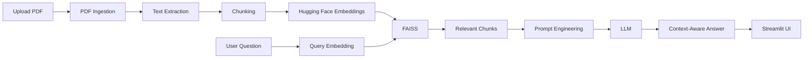
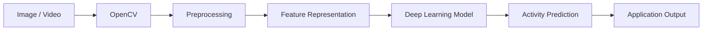
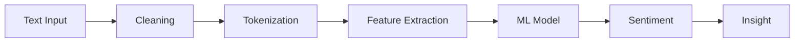
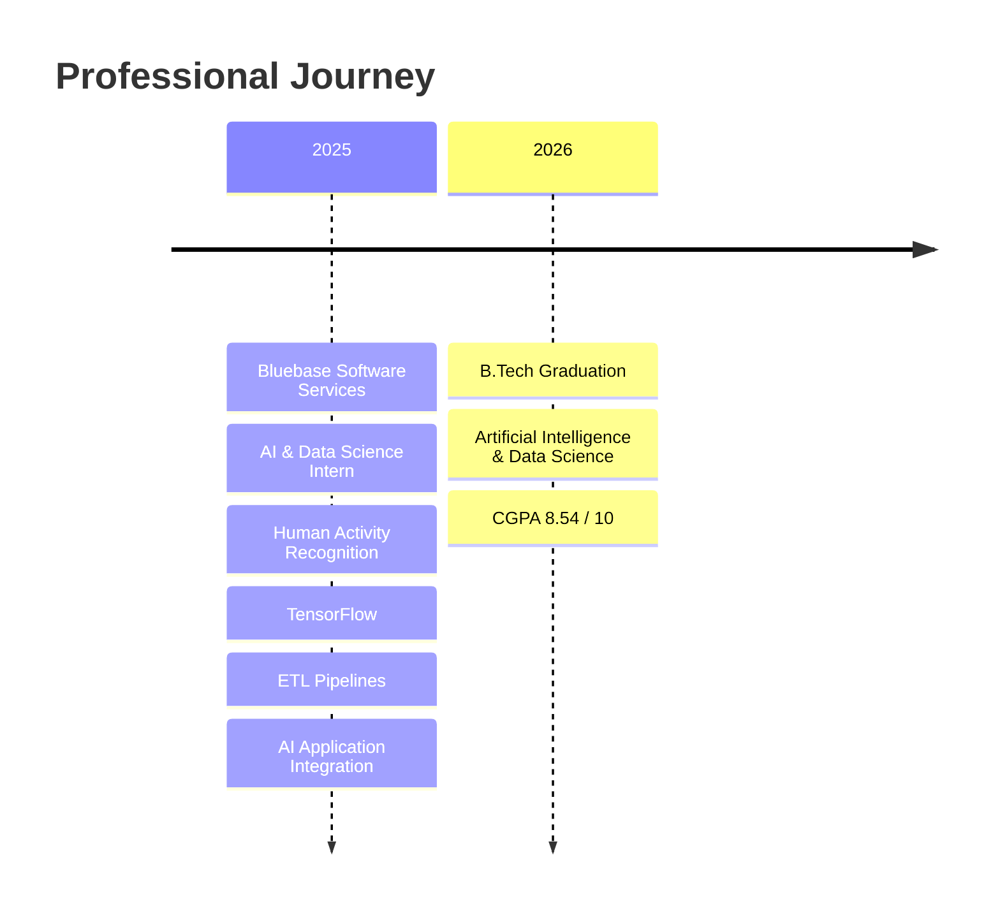
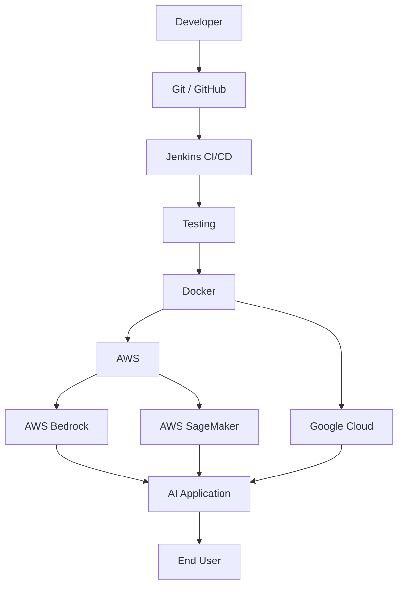

<div align="center">


<br>


</div>

---

# `PRIYA // AI LAB`

<div align="center">

### `DATA → MODELS → INTELLIGENCE → IMPACT`

</div>

I'm a **B.Tech Artificial Intelligence & Data Science graduate (2026)** focused on building AI-powered applications, machine learning systems, Generative AI solutions, and data-driven products.

My technical interests include **Machine Learning, Deep Learning, LLMs, RAG, LangChain, NLP, Computer Vision, APIs, Cloud, and CI/CD**.

---

# 🧬 Developer Profile

```python
developer = {
    "name": "Priya Tharsini G P",
    "role": "AI & Data Science Graduate",
    "education": "B.Tech Artificial Intelligence & Data Science",
    "cgpa": "8.54 / 10.0",

    "primary_focus": [
        "Artificial Intelligence",
        "Machine Learning",
        "Generative AI",
        "LLM Applications",
        "RAG Systems"
    ],

    "engineering": [
        "REST APIs",
        "FastAPI",
        "Flask",
        "Git",
        "GitHub",
        "Jenkins CI/CD"
    ],

    "data": [
        "Python",
        "SQL",
        "PostgreSQL",
        "MongoDB",
        "FAISS"
    ],

    "cloud": [
        "AWS",
        "AWS Bedrock",
        "AWS SageMaker",
        "GCP",
        "Docker"
    ],

    "mindset": "Build → Test → Optimize → Deploy"
}
```

---

# ⚡ TECHNOLOGY MATRIX

<div align="center">

### Programming


<br>

`Python` `SQL` `R` `Java (Basic)` `JavaScript`

---

### Artificial Intelligence


<br>

`Machine Learning` `Deep Learning` `Neural Networks`

`Generative AI` `LLMs` `Prompt Engineering` `RAG`

`LangChain` `Hugging Face Transformers`

---

### Backend & APIs


<br>

`REST APIs` `FastAPI` `Flask` `API Integration`

`Debugging` `Unit Testing`

---

### Frontend


<br>

`ReactJS` `NodeJS` `JavaScript`

---

### Data & Databases


<br>

`PostgreSQL` `MongoDB` `FAISS`

`Pandas` `NumPy` `Scikit-learn`

---

### Cloud & DevOps


<br>

`AWS Bedrock` `AWS SageMaker` `GCP`

`Docker` `Jenkins` `CI/CD`

</div>

---

# 🧠 AI ENGINEERING MAP



---

# 🔥 AI APPLICATION PIPELINE



---

# 🧩 RAG ENGINEERING

One of my key areas of interest is **Retrieval-Augmented Generation**.



### RAG Stack

```text
Documents
    ↓
PDF Processing
    ↓
Text Extraction
    ↓
Chunking
    ↓
Embeddings
    ↓
FAISS
    ↓
Semantic Search
    ↓
Prompt Engineering
    ↓
LLM
    ↓
Context-Aware Response
```

---

# 🚀 FEATURED PROJECTS

## 🧠 SoulSpace

### Digital Mental Health & Psychological Support System



### Core Technologies

`Python` `Generative AI` `LLMs` `Prompt Engineering` `Streamlit`

### Key Features

- AI-powered conversational support
- Context-aware responses
- Multiple assessment modules
- Automated scoring
- Emotion analysis
- Interactive dashboards
- Assessment history
- User authentication
- Progress tracking
- GitHub-based version control
- Jenkins CI/CD automation

🔗 **[Explore SoulSpace →](https://github.com/Priyaprakash-1/Soulspace-Digital-mental-health-and-psychological-support-system)**

---

# 📚 AI-Powered Question Answering Bot

### Retrieval-Augmented Generation System

A RAG chatbot designed to answer questions from uploaded PDF documents using semantic retrieval and LLM-based response generation.



### Technologies

`Python` `LangChain` `FAISS` `Hugging Face`

`LLMs` `RAG` `Prompt Engineering` `Streamlit`

### Engineering Focus

- Document ingestion
- Text extraction
- Chunking
- Embedding generation
- Semantic vector search
- Retrieval optimization
- Prompt engineering
- Hallucination reduction
- Real-time question answering

---

# 👁️ Human Activity Recognition

### Computer Vision + Deep Learning



**Stack**

`Python` `OpenCV` `TensorFlow` `Deep Learning`

---

# 💬 NLP / Sentiment Analysis



**Stack**

`Python` `NLP` `Machine Learning` `Pandas` `NumPy`

---

# 💼 EXPERIENCE



---

# 🏗️ ENGINEERING WORKFLOW

```text
                 ┌──────────────────────┐
                 │       IDEA           │
                 └──────────┬───────────┘
                            ↓
                 ┌──────────────────────┐
                 │   DATA / DOCUMENTS   │
                 └──────────┬───────────┘
                            ↓
                 ┌──────────────────────┐
                 │    PROCESSING        │
                 └──────────┬───────────┘
                            ↓
                 ┌──────────────────────┐
                 │   MODEL / LLM / RAG  │
                 └──────────┬───────────┘
                            ↓
                 ┌──────────────────────┐
                 │   TEST & VALIDATE    │
                 └──────────┬───────────┘
                            ↓
                 ┌──────────────────────┐
                 │      API / UI        │
                 └──────────┬───────────┘
                            ↓
                 ┌──────────────────────┐
                 │   DOCKER / CLOUD     │
                 └──────────┬───────────┘
                            ↓
                 ┌──────────────────────┐
                 │   JENKINS CI / CD    │
                 └──────────┬───────────┘
                            ↓
                 ┌──────────────────────┐
                 │      DEPLOY          │
                 └──────────────────────┘
```

---

# 📊 GITHUB ANALYTICS

<div align="center">


</div>

<br>

<div align="center">


</div>

---

# 📈 CONTRIBUTION ACTIVITY

<div align="center">


</div>

---

# 🐍 CONTRIBUTION SNAKE

<div align="center">


</div>

---

# 🏆 GITHUB TROPHIES

<div align="center">


</div>

---

# 📊 SKILL RADAR

```text
                    AI / ML
                      ▲
                      │
                ███████████
             ███           ███
          ███                 ███
   Cloud ██                     ██ GenAI
       ███                       ███
       ██                         ██
       ██                         ██
       ███                       ███
        ███                     ███
          ███                 ███
             ███           ███
                ███████████
                      │
                  Data / APIs
```

### Core Focus

```text
Artificial Intelligence     ████████████████████
Machine Learning            ███████████████████░
Generative AI               ██████████████████░░
RAG / LLM Applications      ██████████████████░░
Python                      ████████████████████
Data Engineering            ████████████████░░░░
Cloud                       ███████████████░░░░░
DevOps / CI-CD              ██████████████░░░░░░
```

---

# ☁️ CLOUD & DEPLOYMENT ARCHITECTURE



---

# 🧪 CURRENTLY EXPLORING

<div align="center">

| Area | Focus |
|---|---|
| 🤖 Generative AI | LLM Applications |
| 🔎 RAG | Retrieval & Semantic Search |
| 🧠 NLP | Embeddings & Context |
| ☁️ Cloud | AWS / GCP |
| ⚙️ DevOps | Docker / Jenkins |
| 🔌 APIs | FastAPI / Flask |
| 🗄️ Data | PostgreSQL / MongoDB |
| 🚀 Deployment | CI/CD |

</div>

---

# 📜 CERTIFICATIONS

```text
Microsoft
├── Data Analysis and Power BI
└── Data Analyst Career Path

Databricks
├── Databricks Fundamentals
└── Azure Databricks Platform Architect

MongoDB
└── Building RAG Applications Using MongoDB

Alteryx
└── Machine Learning Fundamentals

IBM
└── Artificial Intelligence

Infosys Springboard
└── AI & Data Science

HP Foundation
└── Agile Methodology
```

---

# 🎯 CAREER INTERESTS

```text
AI Engineer
     │
     ├── Machine Learning Engineer
     ├── Generative AI Engineer
     ├── AI/ML Engineer
     ├── Data Scientist
     ├── Data Analyst
     └── AI Application Developer
```

---

# 📌 ENGINEERING PRINCIPLES

```text
01  Build with purpose
02  Validate with data
03  Optimize continuously
04  Write maintainable code
05  Test before deployment
06  Automate repetitive workflows
07  Learn continuously
08  Deploy what you build
```

---

# 🌐 CONNECT

<div align="center">

<a href="https://www.linkedin.com/in/priya-tharsini-gp/">

</a>

<a href="mailto:priyaprakasham25@gmail.com">

</a>

<a href="https://github.com/Priyaprakash-1">

</a>

</div>

<br>

<div align="center">

### `BUILD • LEARN • EXPERIMENT • DEPLOY`


</div>
